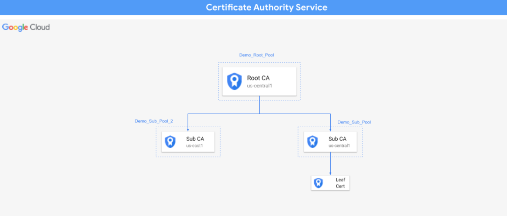

# Demo Guide
This Cloud Security Architecture uses terraform to setup Certificate Authority Certificate demo in a project and underlying infrastructure using Google Cloud Services like [Certificate Authority Service](https://cloud.google.com/certificate-authority-service) and [Cloud Storage](https://cloud.google.com/storage).


## Demo Architecture Diagram
The image below describes the architecture of CSA Certificate Authority Service demo.




## What resources are created?
Main resources:
- A root certificate authority
- Two sub certificate authorities in different regions
- A certificate from one of the sub certificate authorities


## How to deploy?
The following steps should be executed in Cloud Shell in the Google Cloud Console. 

### 1. Create a project and enable billing
Follow the steps in [this guide](https://cloud.google.com/resource-manager/docs/creating-managing-projects).

### 2. Get the code
Clone this github repository go to the root of the repository.

``` 
git clone https://github.com/mgaur10/csa-certificate-auth-service.git
cd csa-certificate-auth-service
```

### 3. Deploy the infrastructure using Terraform

From the root folder of this repo, run the following commands:

```
export TF_VAR_demo_project_id=[YOUR_PROJECT_ID]
terraform init
terraform apply
```

**Note:** All the other variables are give a default value. If you wish to change, update the corresponding variables in variable.tf file.


## How to clean-up?

From the root folder of this repo, run the following command:
```
terraform destroy
```


