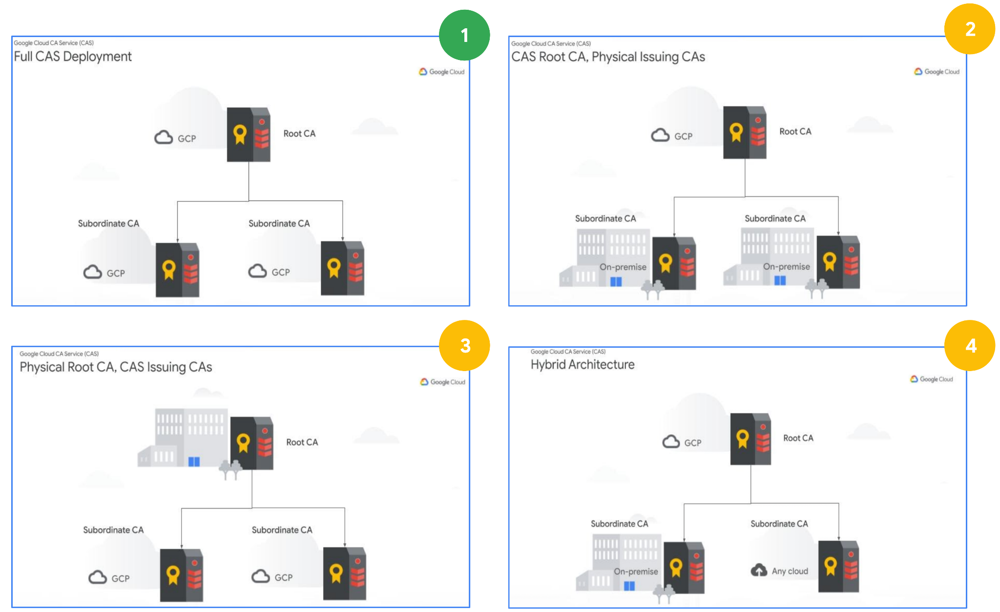
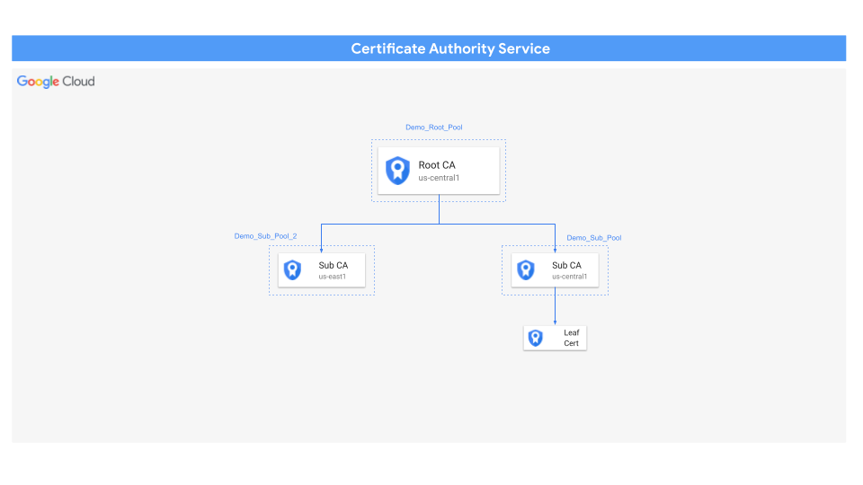
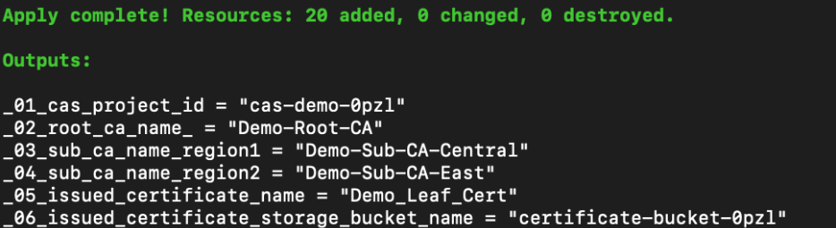
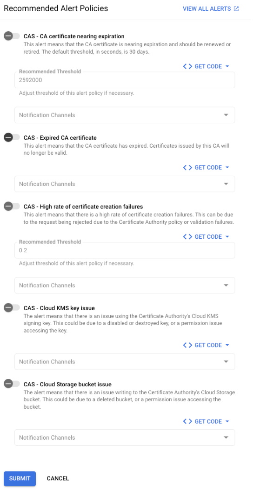
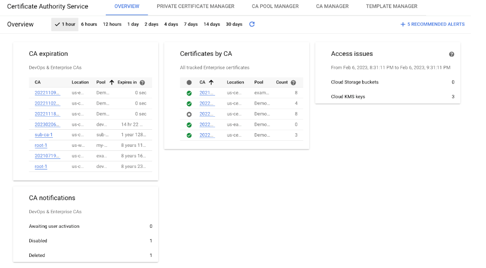

```
This is not an officially supported Google product.
This code creates PoC demo environment for CSA Certificate Authority Service demo. This demo code is not built for production workload. 
```

# Summary

This architecture guide enables a streamlined, secure deployment of [Certificate Authority Service](https://cloud.google.com/certificate-authority-service/docs) (CAS). It creates a root certificate authority along with two subordinate certificate authorities and one leaf certificate. These certificate authorities are highly available, scalable, and simple to maintain, enabling you to build a private Public Key Infrastructure (PKI) to assert identities via certificates and establish a root of trust across your workloads.

While this architecture guide focuses on a full CAS deployment - denoted as architecture 1 in the figure below (i.e., one where all certificate authorities are hosted in Google Cloud) - CAS is extremely flexible and empowers your organization to create a private PKI in a variety of different ways as depicted in the diagram below.



We'll also provide details on how to use CSR (Certificate Signing Request) to implement Hybrid architecture, in which CAs can reside outside of GCP (architectures #2-3).

# Architecture 

## Design Diagram



## Product and services

[Certificate Authority Service (CAS)](https://cloud.google.com/certificate-authority-service) - Certificate Authority Service is a highly available, scalable Google Cloud service that enables you to simplify, automate, and customize the deployment, management, and security of private certificate authorities (CA).

[Key Management Service (KMS)](https://cloud.google.com/security-key-management) - Cloud Key Management Service allows you to create, import, and manage cryptographic keys and perform cryptographic operations in a single centralized cloud service. You can use these keys and perform these operations by using Cloud KMS directly, by using Cloud HSM or Cloud External Key Manager, or by using Customer-Managed Encryption Keys (CMEK) integrations within other Google Cloud services.

[Google Cloud Storage (GCS)](https://cloud.google.com/storage) - Cloud Storage is a managed service for storing unstructured data. Store any amount of data and retrieve it as often as you like.

## Design considerations

When designing PKI with GCP CAS, the following limits should be taken into consideration as well as [quotas and limit](https://cloud.google.com/certificate-authority-service/quotas) and [known limitations](https://cloud.google.com/certificate-authority-service/docs/known-limitations):

<table>
  <thead>
    <tr>
      <th><strong>Resource</strong></th>
      <th><strong>Unit</strong></th>
      <th><strong>Value</strong></th>
    </tr>
  </thead>
  <tbody>
    <tr>
      <td>Pending CAs<sup>1</sup></td>
      <td>per Location per Project</td>
      <td>100</td>
    </tr>
    <tr>
      <td>CAs</td>
      <td>per Location per Project</td>
      <td>1,000</td>
    </tr>
    <tr>
      <td>Unexpired revoked certificates<sup>2</sup></td>
      <td>per CA or certificate revocation list (CRL)</td>
      <td>500,000</td>
    </tr>
  </tbody>
</table>

<sup>1</sup> pending certificate authority (CA) is a subordinate CA that has been created but not yet activated, and is thus in the AWAITING_USER_ACTIVATION [state](https://cloud.google.com/certificate-authority-service/docs/reference/rest/v1beta1/projects.locations.certificateAuthorities#State).  
<sup>2</sup> CRL can contain at most 500,000 unexpired revoked certificates. If you attempt to revoke more than this limit, the revocation request fails. If you need to revoke more than 500,000 certificates, we recommend that you wait until the existing revoked certificates have expired or revoke the issuing CA certificate.


# Deployment

##Terraform Instructions:

1. Sign in to your organization and assign yourself a **CA Service Admin **and** Cloud KMS Admin** role on the project to be used for the deployment.

2. If a new project needs to be created and enable billing. Follow the steps in [this guide](https://cloud.google.com/resource-manager/docs/creating-managing-projects).

3. Open up Cloud shell and clone the following [git repository](https://github.com/GoogleCloudPlatform/csa-certificate-authority-service) using the command below:

```
git clone https://github.com/GCP-Architecture-Guides/csa-certificate-authority-service.git
```

4. Navigate to the csa-certificate-authority-service folder.

```
cd csa-certificate-authority-service</th>
```
5. Export the project id in the Terraform variable

```
export TF_VAR_demo_project_id=[YOUR_PROJECT_ID]
```

6. While in the csa-certificate-authority-service folder, run the commands below in order. 

```
terraform init

terraform plan

terraform apply
```

> if prompted, authorize the API call.

7. Once deployment is finished it will publish the output summary of assets orchestrated. It deploys the resources within five minutes.



8. After completing the demo, navigate to the certificate-authority-service folder and run the command below to destroy all demo resources.

```
terraform destroy
```

##Terraform Summary:

<table>
  <thead>
    <tr>
      <th><strong>Pool</strong></th>
      <th><strong>CA</strong></th>
      <th><strong>Validity</strong></th>
      <th><strong>State</strong></th>
      <th><strong>Subject Name</strong></th>
      <th><strong>Region</strong></th>
      <th><strong>Tier</strong></th>
    </tr>
  </thead>
  <tbody>
    <tr>
      <td><em>Demo-Root-Pool</em></td>
      <td><em>Root CA</em></td>
      <td>10 years</td>
      <td>Enabled</td>
      <td>Organization: <em>Demo</em><br>
<br>
CA CN:<em> Demo</em><br>
<br>
Resource ID: [default]</td>
      <td>us-central1 (Iowa)</td>
      <td>Enterprise</td>
    </tr>
    <tr>
      <td><em>Demo-Sub-Pool</em></td>
      <td><em>Sub CA with Root CA in Google Cloud</em></td>
      <td>3 years</td>
      <td>Enabled</td>
      <td>Organization: <em>Demo</em><br>
<br>
CA CN:<em> Demo</em><br>
<br>
Resource ID: [default]</td>
      <td>us-central1 (Iowa)</td>
      <td>Enterprise</td>
    </tr>
    <tr>
      <td><em>Demo-Sub-Pool-2</em></td>
      <td><em>Sub CA with Root CA in Google Cloud</em></td>
      <td>3 years</td>
      <td>Enabled</td>
      <td>Organization: <em>Demo</em><br>
<br>
CA CN:<em> Demo</em><br>
<br>
Resource ID: [default]</td>
      <td>us-east1</td>
      <td>Enterprise</td>
    </tr>
  </tbody>
</table>

<table>
  <thead>
    <tr>
      <th><strong>Pool</strong></th>
      <th><strong>Accepted CSR Methods</strong></th>
      <th><strong>Allowed Keys & Algorithms</strong></th>
      <th><strong>Key Size & Algorithm</strong></th>
      <th><strong>Publishing Options</strong></th>
      <th><strong>Configured Baseline Values</strong></th>
      <th><strong>Configured Extension Constraints</strong></th>
      <th><strong>Configured Identity Constraints</strong></th>
    </tr>
  </thead>
  <tbody>
    <tr>
      <td><em>Demo-Root-Pool</em></td>
      <td>Allow all</td>
      <td>No restrictions</td>
      <td>RSA_PKCS1_4096_SHA256</td>
      <td>To GCS Bucket in PEM format</td>
      <td>None</td>
      <td>Copy all extensions from certificate requests</td>
      <td>Copy subject and SAN(s) from certificate requests</td>
    </tr>
    <tr>
      <td><em>Demo-Sub-Pool</em></td>
      <td>Allow all</td>
      <td>No restrictions</td>
      <td>RSA_PKCS1_4096_SHA256</td>
      <td>To GCS Bucket in PEM format</td>
      <td>None</td>
      <td>Copy all extensions from certificate requests</td>
      <td>Copy subject and SAN(s) from certificate requests</td>
    </tr>
    <tr>
      <td><em>Demo-Sub-Pool-2</em></td>
      <td>Allow all</td>
      <td>No restrictions</td>
      <td>RSA_PKCS1_4096_SHA256</td>
      <td>To GCS Bucket in PEM format</td>
      <td>None</td>
      <td>Copy all extensions from certificate requests</td>
      <td>Copy subject and SAN(s) from certificate requests</td>
    </tr>
  </tbody>
</table>


# Best Practices

[Best practices for Certificate Authority Service](https://cloud.google.com/certificate-authority-service/docs/best-practices)

# Operations

## Logging And Monitoring

Google Cloud's Certificate Authority Service has several logging and monitoring requirements to ensure the security and integrity of the service. These requirements include the following:

-  Audit logging: Log operations performed on the service, such as certificate issuance, renewal, and revocation, are logged and can be audited by customers.
-  Event notifications: Customers can receive notifications for important events, such as certificate expiration, via email or through a webhook.
-  Certificate transparency: All issued certificates are logged to Transparency logs, which allows audit of issuance and revocation of certificates.
-  Security and availability monitoring: Security and operations teams constantly monitor the service for potential security threats and availability issues.
-  Compliance: Google Cloud's Certificate Authority Service is compliant with various standards which specify security and operational requirements for certificate authorities.

Overall, these logging and monitoring requirements aim to provide customers with transparency and visibility into the service, while also ensuring the security and availability of the service.

## Audit Logging

Google Cloud services write audit logs to help you answer the questions, "Who did what, where, and when?" within your Google Cloud resources.

### Available audit logs

The following types of audit logs are available for CA Service:

-  Admin Activity audit logs   
Includes "admin write" operations that write metadata or configuration information.  
You can't disable Admin Activity audit logs.
-  Data Access audit logs  
Includes "admin read" operations that read metadata or configuration information. Also includes "data read" and "data write" operations that read or write user-provided data.  
To receive Data Access audit logs, you must [explicitly enable](https://cloud.google.com/logging/docs/audit/configure-data-access#config-console-enable) them.
-  For specific audit logs created by the Certificate Authority Service, [please refer](https://cloud.google.com/certificate-authority-service/docs/audit-logging).

## Enable audit logging

Admin Activity audit logs are always enabled; you can't disable them.  
Data Access audit logs are disabled by default and aren't written unless explicitly enabled.  
For information about enabling some or all of your Data Access audit logs, see [Enable Data Access audit logs](https://cloud.google.com/logging/docs/audit/configure-data-access).

## View CAS logs

In the Google Cloud console, you can use the Logs Explorer to retrieve your audit log entries for your Cloud project, folder, or organization:

1. In the Google Cloud console, go to the Logging> Logs Explorer page.
1. Select an existing Cloud project, folder, or organization.
1. In the Query builder pane, do the following:

```
protoPayload.serviceName="privateca.googleapis.com"
```

## Monitoring Alerting and Reporting

Cloud Monitoring can be used to monitor operations performed on resources in Certificate Authority Service.

### Enabling Recommended Alerts

Use the following instructions to enable recommended alerts.

1. Go to the CA Service Overview page in the Google Cloud console.
1. On the top right of the Overview page, click the **+ 5 Recommended Alerts**.
1. Enable or disable each alert, reading its description.
    -  Some alerts support custom thresholds. For example, you can specify when you want to be alerted for an expiring CA certificate, or the error rate for a high rate of certificate creation failures.
    -  All alerts support [notification channels](https://cloud.google.com/monitoring/support/notification-options).

1. Click **Submit** once you have enabled all desired alerts.





## Digital Forensic and Incident Response


### Preparation for CA Compromise:

1. Document certificate policies and templates
    - To mitigate risk of abuse, certificate policies should be reviewed to ensure that templates have approved and defined functionality
      -  Identity constraints
      -  Extension constraints
      -  Key usage conditions
      -  Policy identifiers
      -  Extensions

2. Create CA compromise response plan
3. Educate all stakeholders
4. Review CA security and communication policies at least annually
5. Establish backup CA plans
6. Inventory CAs
7. Verify that only approved CAs are used
8. Ensure only approved roots are trusted
9. Inventory Root CAs that are trusted on relying party systems
10. Review and verify permissions for existing certificate templates
11. Enforce revocation checking on relying party systems
12. Enable audit logs and alerts

### Responding to a CA Compromise:

1. Identify the compromise based on alerting & reporting design
2. Establish clear understanding of what occurred
    - Who detected the incident.
    - If available, who perpetrated the incident.
    - When the CA was compromised.
    - Where the incident occurred.
    - Which Roots, sub-CAs and the number of end-user certificates affected by the incident.
    - The believed underlying cause of the incident.
    - What remedial measures were taken or will be taken to address the underlying cause of the incident.
    - A list of certificates and domains involved in the breach.
    - How was the incident detected?
    - Detailed description of the exploit.
    - Details about what infrastructure was compromised.
    - Details about how the infrastructure was compromised.
    - A detailed timeline of events.
    - Was the vulnerability detected by normal operations? If it was not, why?
    - Was the vulnerability discovered in the most-recent audit? If yes, was the vulnerability remediated? If the vulnerability was not remediated, why not?
    - Was this vulnerability detected by the most-recent audit? If not, please explain why.
    - What policy changes need to be made?
    - Any other information appropriate.

3. Activate the incident response team
4. Contain and isolate the impacted CA environment
    a. To disable a CA from being able to issue certificates, [refer here](https://cloud.google.com/certificate-authority-service/docs/managing-ca-state#disable)

5. Establish a plan to communicate impact and next-step mitigations to impacted stakeholders (internal / external)
6. Upon completion of an investigation and verified containment, perform the following:
    - Revoke and reset credentials for any compromised identities that were mapped to a role that provides elevated permissions for CAs and associated policies/templates.[link1](https://cloud.google.com/certificate-authority-service/docs/configuring-iam)  
[link2](https://cloud.google.com/certificate-authority-service/docs/reference/permissions-and-roles)
    - Revoke compromised CAs and associated certificates and establish new CAs [refer here](https://cloud.google.com/certificate-authority-service/docs/managing-ca-rotation)
    - Add to CRL/update status in OCSP Responder (if not automated) to notify subjects, relying parties, and vendors
    - Revoke existing certificates and reissue certificates from new CAs [refer here](https://cloud.google.com/certificate-authority-service/docs/revoking-certificates)
    - Remove/replace root certificates
    - Validate that revocation checking is enabled on relying party systems
    - Validate cert and root replacements

7. Track and report on progress

# Governance, Risk Management, and Compliance

# Cost

Please see the estimated monthly cost to run this demonstration environment, below. Note, this has been estimated at the time of pattern creation, the estimate may change with time and may vary per region, please review the cost of each resource at [Google Cloud Pricing Calculator](https://cloud.google.com/products/calculator).

<table>
  <thead>
    <tr>
      <th></th>
      <th><strong>DevOps SKU</strong></th>
      <th><strong>Enterprise SKU</strong></th>
    </tr>
  </thead>
  <tbody>
    <tr>
      <td><strong>Monthly CA fee</strong></td>
      <td>$20</td>
      <td>$200</td>
    </tr>
    <tr>
      <td><strong>Certificate fees<br>
</strong></td>
      <td>0-50K @ $0.3<br>
50K -100K @ $0.03<br>
100K+ @ $0.0009<br>
<br>
Tiering ACROSS CAs</td>
      <td>0-50K @ $0.5<br>
50K -100K @ $0.05<br>
100K+ @ $0.001<br>
<br>
Tiering ACROSS CAs</td>
    </tr>
    <tr>
      <td><strong>HSM support for CA key</strong></td>
      <td><ul>
<li> </li>
</ul>
</td>
      <td><ul>
<li></li>
</ul>
</td>
    </tr>
    <tr>
      <td><strong>BYO CA key </strong></td>
      <td>    X</td>
      <td><ul>
<li></li>
</ul>
</td>
    </tr>
    <tr>
      <td><strong>Certificates tracked and revocation</strong></td>
      <td>                 X</td>
      <td><ul>
<li></li>
</ul>
</td>
    </tr>
    <tr>
      <td><strong>QPS</strong></td>
      <td>                25 </td>
      <td>7 </td>
    </tr>
    <tr>
      <td><strong>Optimized for ...</strong></td>
      <td>High volume, short lived</td>
      <td>Low volume, long lived</td>
    </tr>
  </tbody>
</table>

# Related Resources

-  [CAS Overview](https://cloud.google.com/certificate-authority-service)
-  [Introducing CAS Blog](https://cloud.google.com/blog/products/identity-security/helping-you-modernize-security-in-the-cloud)
-  [CAS Instructional Videos](https://www.youtube.com/watch?v=CrGYwkE2gPs&list=PLIivdWyY5sqI05hOAi0YgZt_eg7G9tpcN&index=2)
-  [CAS GitHub Repo](https://github.com/mgaur10/certificate-authority-service)

