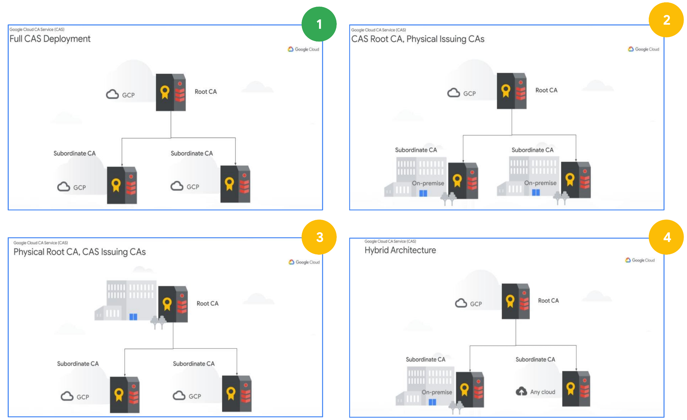
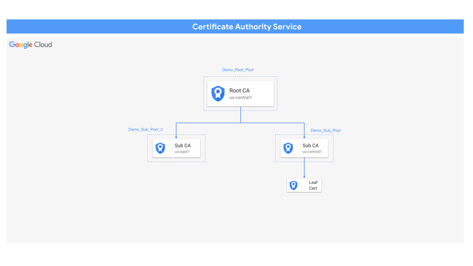

# Certificate Authority Service Demo (CSA)

This is not an officially supported Google product.
This code creates a PoC demo environment for CSA Certificate Authority Service (CAS). This demo code is not built for production workloads.

---

## Modernization Highlights

This repository has been modernized to adhere to current Google Cloud and Terraform best practices:
1. **Terraform Version & Provider Upgrades**: Updated the required Terraform version to `>= 1.3.0` and specified explicit version constraints for the `google`, `tls`, and `time` providers in `provider.tf`.
2. **Removal of Imperative Provisioners (`local-exec`)**: Replaced fragile `local-exec` bash provisioners that called the `gcloud` CLI to export certificates locally and then delete them.
3. **Declarative Certificate Uploads**: Replaced the shell scripts with standard, native `google_storage_bucket_object` resource definitions utilizing the `content` argument. The private key, certificate, and certificate chain are now handled declaratively using properties directly from the `tls_private_key`, `tls_cert_request`, and `google_privateca_certificate` resources.
4. **Enhanced Portability**: The infrastructure is now 100% platform-agnostic and can be deployed smoothly via remote backend execution systems (e.g., Terraform Cloud, GitLab CI, GitHub Actions) without requiring local installation of the `gcloud` CLI or POSIX shell utilities.
5. **Strict Variable Typing & Descriptions**: Standardized and enforced strong typing across variable structures in both root and child modules.
6. **Validation & Quality Controls**: Standardized codebase formatting with `terraform fmt` and verified syntactical and logical correctness with `terraform validate`.

---

## Summary

This architecture guide enables a streamlined, secure deployment of [Certificate Authority Service](https://cloud.google.com/certificate-authority-service/docs) (CAS). It creates a root certificate authority along with two subordinate certificate authorities and one leaf certificate. These certificate authorities are highly available, scalable, and simple to maintain, enabling you to build a private Public Key Infrastructure (PKI) to assert identities via certificates and establish a root of trust across your workloads.

While this architecture guide focuses on a full CAS deployment - denoted as architecture 1 in the figure below (i.e., one where all certificate authorities are hosted in Google Cloud) - CAS is extremely flexible and empowers your organization to create a private PKI in a variety of different ways as depicted in the diagram below.



We'll also provide details on how to use CSR (Certificate Signing Request) to implement Hybrid architecture, in which CAs can reside outside of GCP (architectures #2-3).

---

## Architecture

### Design Diagram



### Product and Services

*   [Certificate Authority Service (CAS)](https://cloud.google.com/certificate-authority-service) - A highly available, scalable Google Cloud service that enables you to simplify, automate, and customize the deployment, management, and security of private certificate authorities (CA).
*   [Key Management Service (KMS)](https://cloud.google.com/security-key-management) - Allows you to create, import, and manage cryptographic keys and perform cryptographic operations in a single centralized cloud service.
*   [Google Cloud Storage (GCS)](https://cloud.google.com/storage) - A managed service for storing unstructured data, used here for hosting published CA certificates and revocation lists.

### Design Considerations

When designing PKI with GCP CAS, the following limits should be taken into consideration as well as [quotas and limits](https://cloud.google.com/certificate-authority-service/quotas) and [known limitations](https://cloud.google.com/certificate-authority-service/docs/known-limitations):

| Resource | Unit | Value |
| :--- | :--- | :--- |
| Pending CAs¹ | per Location per Project | 100 |
| CAs | per Location per Project | 1,000 |
| Unexpired revoked certificates² | per CA or certificate revocation list (CRL) | 500,000 |

¹ *A pending certificate authority (CA) is a subordinate CA that has been created but not yet activated, and is thus in the `AWAITING_USER_ACTIVATION` state.*  
² *A CRL can contain at most 500,000 unexpired revoked certificates. If you attempt to revoke more than this limit, the revocation request fails. If you need to revoke more than 500,000 certificates, we recommend that you wait until the existing revoked certificates have expired or revoke the issuing CA certificate.*

---

## Deployment

### Terraform Instructions

1.  Sign in to your Google Cloud organization and assign yourself the **CA Service Admin** and **Cloud KMS Admin** roles on the project to be used for the deployment.
2.  If you need to create a new project and enable billing, follow the steps in [this guide](https://cloud.google.com/resource-manager/docs/creating-managing-projects).
3.  Open Cloud Shell or your local terminal and clone the repository:
    ```bash
    git clone https://github.com/GCP-Architecture-Guides/csa-certificate-authority-service.git
    ```
4.  Navigate to the cloned directory:
    ```bash
    cd csa-certificate-authority-service
    ```
5.  Set your project ID via the environment variable used by Terraform:
    ```bash
    export TF_VAR_demo_project_id=[YOUR_PROJECT_ID]
    ```
6.  Initialize, plan, and apply the configuration:
    ```bash
    terraform init
    terraform plan
    terraform apply
    ```
    *(Confirm the apply action by typing `yes` when prompted)*
7.  Upon completion, the outputs will display the resource names, project IDs, and details of the generated resources.
8.  To clean up and destroy all created resources:
    ```bash
    terraform destroy
    ```

---

## Terraform Architecture Summary

### CA Pool Details

| Pool | CA Type | Validity | State | Subject Configuration | Primary Region | Tier |
| :--- | :--- | :--- | :--- | :--- | :--- | :--- |
| **Demo-Root-Pool** | Root CA (Self-Signed) | 10 years | Enabled | Org: `Demo`, CN: `Demo` | `us-central1` | Enterprise |
| **Demo-Sub-Pool-Central** | Subordinate CA | 3 years | Enabled | Org: `Demo`, CN: `Demo` | `us-central1` | Enterprise |
| **Demo-Sub-Pool-East** | Subordinate CA | 3 years | Enabled | Org: `Demo`, CN: `Demo` | `us-east1` | Enterprise |

### Pool Security Configurations

| Pool | CSR Methods | Allowed Algorithms | Key Size & Algorithm | Publishing Options | Extensions Constraint | Identity Constraints |
| :--- | :--- | :--- | :--- | :--- | :--- | :--- |
| **Demo-Root-Pool** | Allow All | No restrictions | `RSA_PKCS1_4096_SHA256` | To GCS in PEM format | Copy all from requests | Copy subject/SAN from requests |
| **Demo-Sub-Pool-Central** | Allow All | No restrictions | `RSA_PKCS1_4096_SHA256` | To GCS in PEM format | Copy all from requests | Copy subject/SAN from requests |
| **Demo-Sub-Pool-East** | Allow All | No restrictions | `RSA_PKCS1_4096_SHA256` | To GCS in PEM format | Copy all from requests | Copy subject/SAN from requests |

---

## Best Practices

Refer to the official [Best practices for Certificate Authority Service](https://cloud.google.com/certificate-authority-service/docs/best-practices).

---

## Operations

### Logging and Monitoring

Google Cloud's Certificate Authority Service has several logging and monitoring capabilities to ensure compliance, auditing, and operational security:
*   **Audit Logging**: Automatically logs configuration and lifecycle events (such as CA creation, activation, and deletion).
*   **Data Access Logs**: Logs data-plane activities (such as certificate issuance, retrieval, and revocation). Must be explicitly enabled.
*   **Logs Explorer Queries**:
    To view CA Service events, use the query builder with:
    ```query
    protoPayload.serviceName="privateca.googleapis.com"
    ```

### Recommended Alerting Setup

You can enable recommended metric alerts directly from the GCP Console:
1.  Go to the **CA Service Overview** page.
2.  In the top-right, click **+ 5 Recommended Alerts**.
3.  Configure thresholds for alerts such as expiring CAs or high rates of certificate generation failures.
4.  Bind alerts to your notification channels and click **Submit**.

### Digital Forensics & Incident Response (DFIR)

#### Preparation for CA Compromise
*   Inventory and regularly audit all Root and Subordinate CAs.
*   Configure explicit path length limits and key usage configurations (e.g. enforcing constraints in the root and subordinate profiles).
*   Establish and regularly practice a compromise response plan.
*   Enable Data Access audit logs and alerts for high-risk operations (e.g. CA disabling or deletion).

#### Response Steps
1.  Identify the compromised resource and contain the incident by **disabling the CA** immediately (refer to [Disabling CAs](https://cloud.google.com/certificate-authority-service/docs/managing-ca-state#disable)).
2.  Establish the scope of impact (CAs affected, list of issued certs, breach mechanism, and timeline).
3.  Revoke the compromised CA certificate and establish replacement infrastructure.
4.  Reissue leaf certificates from safe, clean subordinate CAs.

---

## Cost Summary

The estimated costs depend on the selected tier (DevOps vs. Enterprise) and active CAs:

| Metric / Feature | DevOps SKU | Enterprise SKU |
| :--- | :--- | :--- |
| **Monthly CA Fee** | $20 | $200 |
| **Certificate Fees** | 0-50K @ $0.30, 50K-100K @ $0.03 | 0-50K @ $0.50, 50K-100K @ $0.05 |
| **Key Type** | Software Key / HSM | HSM Dedicated |
| **Use Case Optimization** | High volume, short-lived | Low volume, long-lived (private PKI) |

For live pricing estimates, see the [Google Cloud Pricing Calculator](https://cloud.google.com/products/calculator).

---

## Related Resources

*   [Google Cloud CAS Overview](https://cloud.google.com/certificate-authority-service)
*   [Best practices for Certificate Authority Service](https://cloud.google.com/certificate-authority-service/docs/best-practices)
*   [Terraform Provider: google_privateca_certificate_authority](https://registry.terraform.io/providers/hashicorp/google/latest/docs/resources/privateca_certificate_authority)
